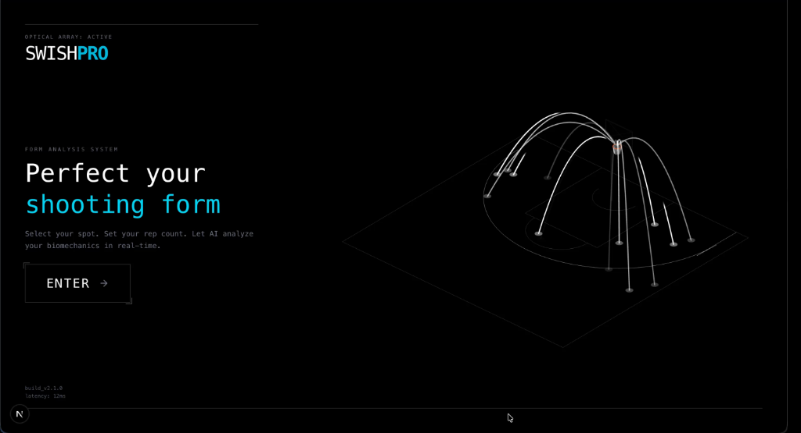
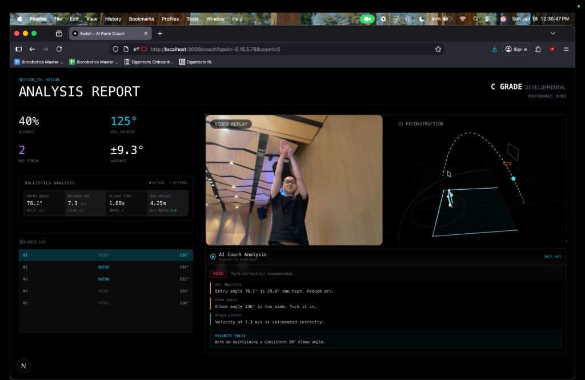
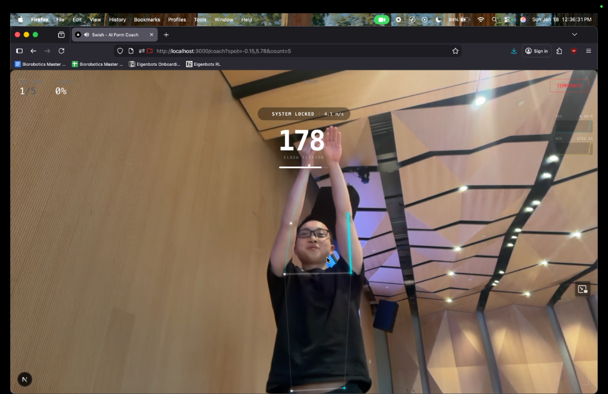
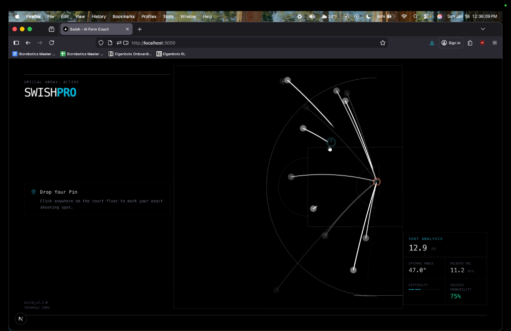

# Swish - AI Form Coach

**1st Place Winner - Education Track @ NexHacks 2026**

Swish is an AI-powered basketball form coach that democratizes access to professional-level training. By combining real-time computer vision, 3D reconstruction, and voice AI, we help players perfect their shooting form without the need for expensive personal coaches.

### Demo Video
[](https://www.youtube.com/watch?v=fwBAmvu9X3I)

### Screenshots
<p align="center">
  
  
</p>
<p align="center">
  
  
</p>

## Inspiration
Through our previous involvement in playing basketball, we found that learning proper shooting form was difficult and often required a personal coach to ensure that bad habits are not learned. We realized that professional coaching is inaccessible to many, and self-taught players often struggle to identify biomechanical flaws on their own.

## What it does
Swish democratizes the learning of proper shooting habits by creating an AI-powered form coach.
- **Shot Simulation**: Users can select spots on a virtual court to run simulated training drills.
- **Biometric Tracking**: The application tracks the user's joints in real-time.
- **Data Analysis**: We capture critical data points like **elbow pitch angle**, **arm velocity**, and **user orientation**.
- **3D Reconstruction**: Using the biometric data, we generate a 3D reconstruction of the shot to simulate flight path and accuracy.
- **Real-time Feedback**: An AI voice coach (powered by LiveKit) provides immediate verbal corrections, while the visual interface offers detailed form analytics.

## How we built it
We leveraged a modern, high-performance tech stack to bring Swish to life:

- **Frontend**: Built with **React 19** and **Next.js 16** for a performant, server-rendered application. Styled with **Tailwind CSS 4** for a sleek, modern aesthetic.
- **3D Graphics**: Utilized **Three.js** and **React Three Fiber** to render the interactive court scene and shot visualizations.
- **AI & Computer Vision**:
    - **Pose Detection**: A lightweight **TensorFlow.js** model fine-tuned for edge devices to detecting joints efficiently in the browser.
    - **Video Analysis**: Integrated **Overshoot** to analyze shot video and provide personalized visual feedback.
- **Real-time Agents**: Used **LiveKit** as the voice agent infrastructure to deliver low-latency verbal coaching to the user.

## Challenges we ran into
- **Browser-based Joint Detection**: Detecting joints efficiently in a browser was a major hurdle. We initially tried MediaPipe but struggled with frame rates low enough to capture high-velocity movements like a shooting motion. We solved this by switching to a specialized, lightweight TensorFlow model, achieving a **15x increase in detection speed** while maintaining accuracy.
- **Real-time Commentary**: Traditional voice APIs (like Google's) felt robotic, and LLM APIs were too slow for real-time sports coaching. **LiveKit Agents** proved to be the perfect solution for minimal latency and natural-sounding feedback.

## Accomplishments that we're proud of
- **3D Reconstruction & Simulation**: Successfully translating 2D video input into a 3D spatial simulation based on joint data.
- **Real-time Performance**: Achieving smooth joint detection and feedback loops directly in the browser.
- **Voice Integration**: Building a seamless conversational agent that feels like a real coach on the sidelines.

## What we learned
We gained deep insights into:
- **LiveKit Agents**: How to architect voice-enabled AI agents for real-time interactivity.
- **Computer Vision Pipelines**: Balancing accuracy vs. performance when running ML models on the client side.
- **3D Web Graphics**: constructing immersive 3D environments and running physics simulations within React Three Fiber.
- **Integration**: Combining multiple sophisticated tools (Overshoot, LiveKit, TensorFlow) into a cohesive user experience.

## What's next for Swish
We are looking to expand this technology to **other sports and activities** (like tennis serves or golf swings) to further democratize biomechanical feedback and form coaching for everyone.

---

## Getting Started

1. **Clone the repository**
   ```bash
   git clone https://github.com/yourusername/swish.git
   cd swish
   ```

2. **Install dependencies**
   ```bash
   npm install
   ```

3. **Set up Environment Variables**
   Create a `.env.local` file with your API keys (LiveKit, OpenAI, etc.).

4. **Run the development server**
   ```bash
   npm run dev
   ```

5. **Open the app**
   Visit [http://localhost:3000](http://localhost:3000) to start your training session!
